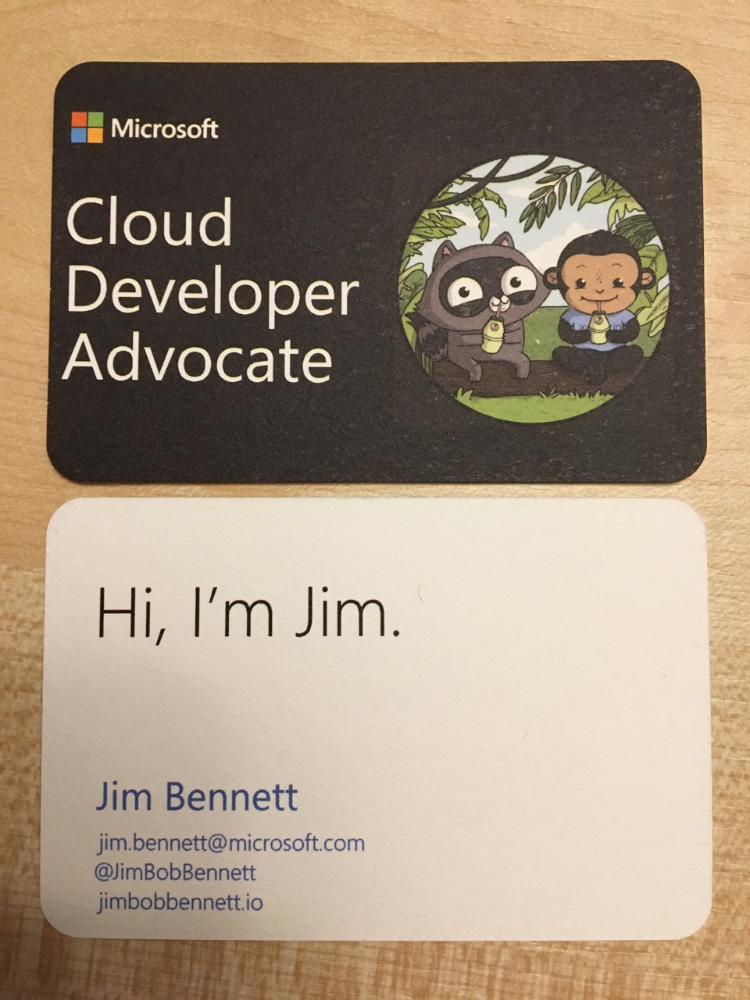

# Business Cards

An awesome template for business cards. The `.ai` files are in Adobe Illustrator format, the `.sketch` file is for use with Sketch on a Mac.

The original template came from [Anthony Chu](https://twitter.com/nthonyChu), who in turn got it from [Alex Karcher](https://twitter.com/AlexKarcher). Thank you both for this.

The cool logo is from [Ashley McNamara](https://twitter.com/ashleymcnamara). All her amazing artwork is available on her [GitHub page](https://github.com/ashleymcnamara/Developer-Advocate-Bit). Thank you for your great art, and sharing it with the world.

Here's what the cards look like when ordered from [Moo](https://refer.moo.com/s/jrb_facebook) and printed on cards made from recycled t-shirt off-cuts. Use [this link](https://refer.moo.com/s/jrb_facebook) to get a discount on your first Moo order.

